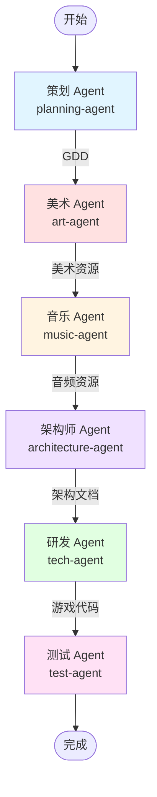
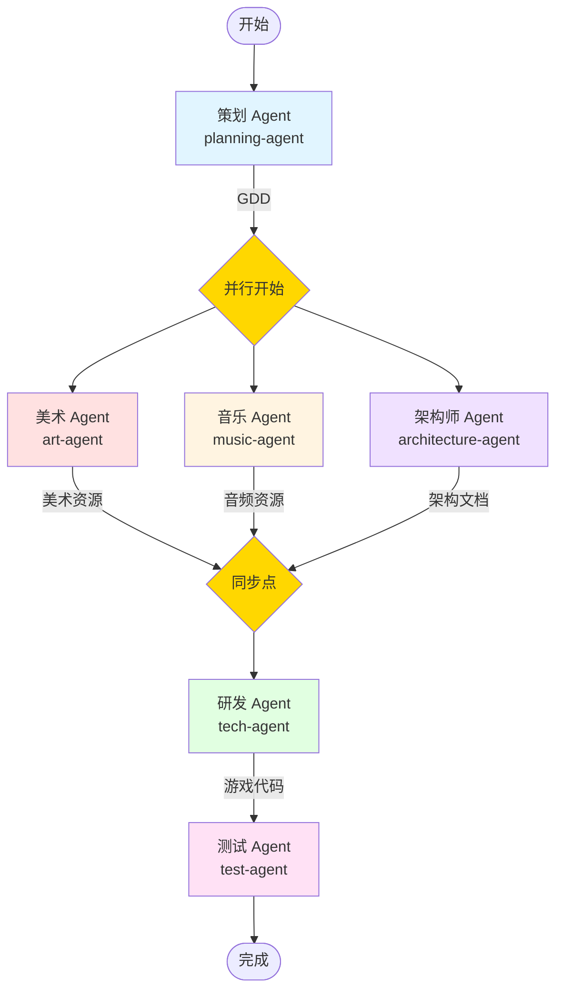
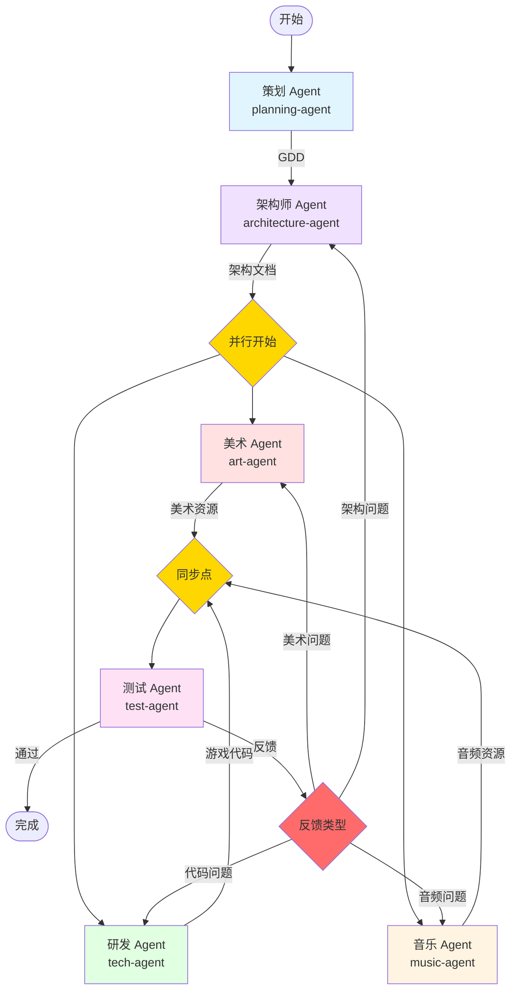

# 游戏开发工作流程图

本文档展示了三种不同的游戏开发工作流模式，每种模式适用于不同的开发场景。

---

## 1. Sequential (瀑布流) 工作流

**适用场景**: 传统项目、需求明确、变更较少的项目

**执行模式**: `sequential` - 严格按顺序执行，每个阶段必须完成后才能开始下一阶段



**流程说明**:
1. **策划阶段**: 生成游戏设计文档 (GDD)
2. **美术阶段**: 基于 GDD 创建美术资源
3. **音乐阶段**: 基于 GDD 创建音频资源
4. **架构阶段**: 基于 GDD 和资源设计技术架构
5. **研发阶段**: 基于架构文档和资源实现游戏代码
6. **测试阶段**: 测试游戏功能和性能

**Agent 间消息交互**:
```
Planning Agent
    ↓ (MessageType.GDD_UPDATE)
Art Agent
    ↓ (MessageType.ASSET_UPDATE - art)
Music Agent
    ↓ (MessageType.ASSET_UPDATE - music)
Architecture Agent
    ↓ (MessageType.COMPLETION - architecture doc)
Tech Agent
    ↓ (MessageType.ASSET_UPDATE - code)
Test Agent
    ↓ (MessageType.TEST_REPORT)
A2A Server (完成)
```

---

## 2. Async Parallel (敏捷并行) 工作流

**适用场景**: 敏捷开发、快速迭代、多团队协作

**执行模式**: `async_parallel` - 策划完成后，美术/音乐/架构师并行工作



**流程说明**:
1. **策划阶段**: 生成游戏设计文档 (GDD)
2. **并行阶段**: 
   - 美术 Agent 创建美术资源
   - 音乐 Agent 创建音频资源
   - 架构师 Agent 设计技术架构
   - 三个 Agent 同时工作，互不阻塞
3. **同步点**: 等待所有并行任务完成
4. **研发阶段**: 整合所有资源和架构，实现游戏代码
5. **测试阶段**: 测试游戏功能和性能

**Agent 间消息交互**:
```
Planning Agent
    ↓ (MessageType.GDD_UPDATE - 广播)
    ├─→ Art Agent
    ├─→ Music Agent
    └─→ Architecture Agent
    
    ┌─ Art Agent → (art assets)
    ├─ Music Agent → (music assets)  → 同步等待
    └─ Architecture Agent → (arch doc)
    
    ↓ (MessageType.ASSET_UPDATE - all resources)
Tech Agent
    ↓ (MessageType.ASSET_UPDATE - code)
Test Agent
    ↓ (MessageType.TEST_REPORT)
A2A Server (完成)
```

---

## 3. Feedback Loop (混合反馈) 工作流

**适用场景**: 需要快速原型、持续优化、质量要求高的项目

**执行模式**: `feedback_loop` - 支持反馈循环，测试结果可反馈给开发阶段



**流程说明**:
1. **策划阶段**: 生成游戏设计文档 (GDD)
2. **架构阶段**: 先设计技术架构和系统方案
3. **并行开发阶段**:
   - 美术 Agent 创建美术资源
   - 音乐 Agent 创建音频资源
   - 研发 Agent 实现游戏代码
   - 三个 Agent 基于架构文档同时工作
4. **测试阶段**: 测试游戏功能和性能
5. **反馈循环**: 
   - 如果测试通过 → 完成
   - 如果发现问题 → 反馈给对应 Agent 进行修复
   - 支持多轮迭代优化

**Agent 间消息交互**:
```
Planning Agent
    ↓ (MessageType.GDD_UPDATE)
Architecture Agent
    ↓ (MessageType.COMPLETION - 广播架构文档)
    ├─→ Art Agent
    ├─→ Music Agent
    └─→ Tech Agent
    
    ┌─ Art Agent → (art assets)
    ├─ Music Agent → (music assets)  → 同步等待
    └─ Tech Agent → (code)
    
    ↓ (MessageType.ASSET_UPDATE - all resources)
Test Agent
    ├─→ (MessageType.TEST_REPORT - pass) → 完成
    └─→ (MessageType.FEEDBACK - issues) → 反馈循环
            ├─→ Tech Agent (代码问题)
            ├─→ Art Agent (美术问题)
            ├─→ Music Agent (音频问题)
            └─→ Architecture Agent (架构问题)
```

---

## 消息类型说明

A2A Server 中使用的 MessageType 枚举：

```typescript
enum MessageType {
  USER_INPUT = "user_input",       // 用户输入
  GDD_UPDATE = "gdd_update",       // GDD 更新
  ASSET_UPDATE = "asset_update",   // 资源更新
  STATUS_UPDATE = "status_update", // 状态更新
  TEST_REPORT = "test_report",     // 测试报告
  FEEDBACK = "feedback",           // 反馈消息
  COMPLETION = "completion",       // 完成消息
  CONFIG = "config",               // 配置消息
  CONTROL = "control",             // 控制消息
  LOG = "log",                     // 日志消息
}
```

---

## 工作流对比

| 特性 | Sequential | Async Parallel | Feedback Loop |
|------|-----------|----------------|---------------|
| **执行方式** | 严格顺序 | 策划后并行 | 架构后并行+反馈 |
| **开发速度** | 慢 | 快 | 中等 |
| **灵活性** | 低 | 中 | 高 |
| **质量保证** | 高 | 中 | 最高 |
| **资源利用** | 低 | 高 | 高 |
| **适用场景** | 传统项目 | 快速迭代 | 高质量项目 |
| **反馈支持** | ❌ | ❌ | ✅ |
| **架构位置** | 音乐之后 | 与美术/音乐并行 | 策划之后（优先） |

---

## Agent 启动和部署

每个 Agent 都支持独立启动和 Docker 部署：

### 本地启动
```bash
# 策划 Agent
npm run start:planning-agent

# 架构师 Agent
npm run start:architecture-agent

# 美术 Agent
npm run start:art-agent

# 音乐 Agent
npm run start:music-agent

# 研发 Agent
npm run start:tech-agent

# 测试 Agent
npm run start:test-agent

# A2A Server
npm run start:a2a-server
```

### Docker 部署
每个 Agent 都有独立的 Dockerfile：
- `src/agents/planning/Dockerfile`
- `src/agents/architecture/Dockerfile`
- `src/agents/art/Dockerfile`
- `src/agents/music/Dockerfile`
- `src/agents/tech/Dockerfile`
- `src/agents/test/Dockerfile`

```bash
# 构建架构师 Agent 镜像
docker build -f src/agents/architecture/Dockerfile -t architecture-agent .

# 运行架构师 Agent 容器
docker run -d \
  --name architecture-agent \
  -e A2A_SERVER_URL=ws://a2a-server:8080 \
  -e NODE_ENV=production \
  architecture-agent
```

---

## 总结

三种工作流各有优势：

1. **Sequential（瀑布流）**: 适合需求明确、流程规范的传统项目
2. **Async Parallel（敏捷并行）**: 适合快速迭代、多团队协作的敏捷项目
3. **Feedback Loop（混合反馈）**: 适合高质量要求、需要持续优化的项目

架构师 Agent 在不同工作流中的定位：
- **Sequential**: 在音乐之后，为研发提供完整的技术方案
- **Async Parallel**: 与美术/音乐并行，快速产出架构设计
- **Feedback Loop**: 在策划之后优先执行，为并行开发提供技术基础
