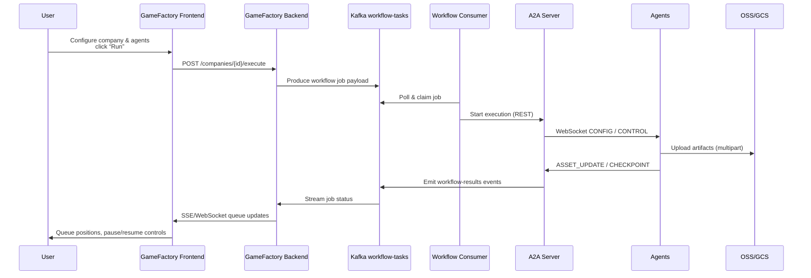
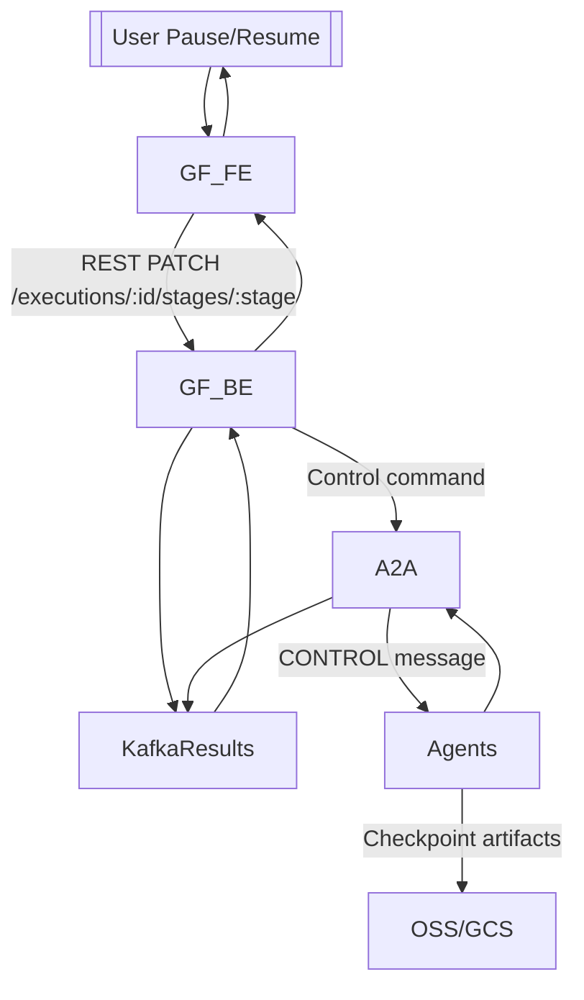

## Distributed Deployment Overview

```mermaid
flowchart LR
    subgraph User_Browser["User Browser"]
        UI["Game Factory Frontend (React)"]
    end

    subgraph GF_FE_Node["Node A<br/>2 vCPU / 4GB"]
        GF_FE["game-factory-frontend<br/>Nginx + SPA"]
    end

    subgraph GF_BE_Node["Node B<br/>4 vCPU / 8GB ×2"]
        GF_BE["game-factory-backend<br/>Express API"]
        Redis["Redis Cluster"]
    end

    subgraph Infra_Kafka["Kafka Cluster<br/>3 × 4 vCPU / 8GB"]
        Kafka["Kafka Brokers<br/>workflow-tasks / workflow-results"]
    end

    subgraph DataPlane["Data Stores"]
        MySQL["MySQL Primary/Replica<br/>8 vCPU / 16GB"]
        OSS["OSS / GCS Buckets"]
    end

    subgraph MyAgent_API["my-agent-test API Tier<br/>Node C<br/>8 vCPU / 16GB ×2"]
        A2A["A2A Server<br/>REST + WS"]
        ExecutionManager["Execution Orchestrator<br/>Redis-backed state"]
    end

    subgraph MyAgent_Consumer["Workflow Consumer Tier<br/>Node D<br/>4 vCPU / 8GB ×2"]
        Consumer["workflow-consumer<br/>Kafka listener"]
    end

    subgraph Agents["Distributed Agents"]
        Plan["Planning Agent"]
        Art["Art Agent"]
        Music["Music Agent"]
        Tech["Tech Agent"]
        Test["Test Agent"]
    end

    UI -->|HTTPS/REST| GF_FE
    GF_FE -->|HTTPS| GF_BE
    GF_BE -->|Auth/CRUD| MySQL
    GF_BE -->|Cache| Redis
    GF_BE -->|publish workflow tasks| Kafka
    Kafka --> Consumer
    Consumer -->|start executions| A2A
    ExecutionManager -->|CONFIG/CONTROL (WebSocket)| Agents
    Agents -->|ASSET_UPDATE / CHECKPOINT| ExecutionManager
    ExecutionManager -->|status stream| Kafka
    Kafka --> GF_BE
    GF_BE -->|notify| UI
    Agents -->|upload artifacts| OSS
    A2A -->|fetch/upload metadata| MySQL
```

### Communication Channels

| Direction | Protocol | Payload |
| --- | --- | --- |
| User ↔ GF Frontend | HTTPS + JWT | UI interactions |
| Frontend ↔ Backend | REST (JSON) + WebSocket (SSE optional) | Auth, companies, workflow queue, pause/resume |
| Backend ↔ Kafka | Kafka (workflow-tasks / workflow-results) | Task job payloads, execution status |
| Backend ↔ Redis | RESP | Job metadata cache, queue positions |
| Backend ↔ MySQL | MySQL | Users, companies, agents, history |
| Backend ↔ my-agent preview | HTTPS | Single-agent preview requests |
| Kafka ↔ my-agent Consumer | Kafka | Task distribution |
| Consumer ↔ A2A | In-memory function call | Execution start helper |
| A2A ↔ Agents | WebSocket + JSON | Stage CONFIG, CONTROL, artifact messages |
| Agents ↔ OSS/GCS | HTTPS multipart upload | Art/Audio/Code assets |
| A2A ↔ Kafka (results) | Kafka | Execution status for frontend |

### Instruction Orchestrator & Clarification Loop

- Instruction Orchestrator 对老板指令做语义检测；如检测到“随便”“差不多”等模糊描述或缺失核心玩法，会生成澄清问题并将执行状态设为 `awaiting_clarification`，阻挡策划阶段。
- 澄清问题、回答与阶段进度被写入 `ExecutionRecord.clarification`，通过 `/api/executions/:id/clarifications` 以及 SSE 事件 `clarification` 暴露给 game-factory。
- game-factory 后端代理 `/workflows/executions/:id/events` 将 A2A 的流式事件推送给前端；前端在 Companies 页面中实时展示协作记录并允许老板以流式方式回答。
- 任意 Agent 在阶段完成时会向 Orchestrator 汇报产物数量与疑问点；若产物缺失或质量异常，Orchestrator 追加新的澄清问题并要求老板补充细节（Tech 阶段会在补充后重新拉取资源清单）。
- 当所有问题回答完毕，Orchestrator 自动恢复执行（更新 Execution 状态为 `running` 并重新触发对应阶段），并把补充内容合并进项目 `additionalRequirements` 供后续 Agent 使用。
- 策划阶段新增 `planningFocus` 配置：game-factory 通过选项（剧情叙事、数值平衡、关卡设计、角色成长/装备/社交/战斗系统）控制 StageConfig，A2A 将该焦点下发给 Planning Agent，生成包含剧情节奏、数值模型、关卡蓝图与系统设计的 GDD。
- 游戏类型枚举扩展为 RPG/SLG/Shooter/MOBA/ACT/AVG/SIM/FTG/RAC/Sandbox/Survival/Card/Casual/Puzzle/Rhythm/Horror，并支持最多两个混合类型；game-factory 会在表单中收集 `genre.primary + subGenre + hybrid[]` 并随 ExecutionRequest 透传给 my-agent-test，Planning/Tech/Art/Music Agent 会基于该元数据检索知识库和模板。

### Capacity Notes (10000 concurrent users)

- REST API tier (GF backend) scaled behind LB: 2 pods × 4 vCPU / 8GB handle ~2k RPS each.  
- Kafka throughput: 3 brokers, replication factor 2 recommended for HA.  
- my-agent consumer pods scaled via KEDA (lag-based) to keep queue < 200 tasks (ETA < 5 min).  
- Agents can be independently autoscaled (CPU/memory or custom metrics such as outstanding stage count).  
- Multipart uploads routed directly to OSS/GCS to avoid API servers handling gigabyte payloads.

### Runtime Secrets & Env Files

The `deploy/distributed_deploy.sh` script expects optional env files under `deploy/env/*.env` to materialise Kubernetes secrets per service:

| File | Secret Name | Typical Content |
| --- | --- | --- |
| `deploy/env/a2a-server.env` | `a2a-env` | `MY_AGENT_API_KEY=xxx`, `REDIS_URL=...` |
| `deploy/env/planning.env` | `planning-env` | Model key, KB endpoints |
| `deploy/env/art.env` | `art-env` | DCC credentials, storage paths |
| `deploy/env/music.env` | `music-env` | Audio model key |
| `deploy/env/tech.env` | `tech-env` | Build pipeline tokens |
| `deploy/env/test.env` | `test-env` | QA harness config |
| `deploy/env/workflow-consumer.env` | `workflow-consumer-env` | Kafka brokers, concurrency limit |

### Storage Paths

- Aliyun OSS uploads rely on `ali-oss` multipart transfer with progress callbacks surfaced back to the queue UI.  
- GCP deployments use `@google-cloud/storage` resumable uploads; signed URLs are issued to browser clients for direct uploads when needed.  
- All artifacts are stored under `/projectId/{stage}/...` with metadata recorded through the `ExecutionManager` for downstream consumption by the Tech/Test agents.

### Resource & Cost Estimates (≈10 000 Concurrency)

Assumptions:

- 35% of concurrent users actively launch workflows during peak hours (≈3 500 workflows queued).  
- Average workflow lifetime 8 minutes (Planning→QA) resulting in ~7.3 workflows/sec steady-state.  
- Storage baseline assumes 250 MB art/audio/code artifacts per workflow.

| Tier / Component | Recommended SKU | Nodes | vCPU / RAM | Monthly (Aliyun) | Monthly (GCP) | Notes |
| --- | --- | --- | --- | --- | --- | --- |
| Game-factory Frontend (SPA) | ecs.c7.large / e2-standard-2 | 2 | 2 / 4 GB | \$70 | \$58 | Nginx + CDN front; autoscale via ALB |
| Game-factory Backend API | ecs.c7.xlarge / e2-standard-4 | 4 | 4 / 8 GB | \$420 | \$360 | 8k RPS aggregate with Redis offload |
| Redis Queue Cache | Tair master+replica / Memorystore M2 | 2 | 2 / 8 GB | \$180 | \$150 | Stores queue state & session cache |
| Kafka Brokers | ecs.c7.2xlarge / e2-standard-8 | 3 | 8 / 16 GB | \$900 | \$780 | RF=2, 20 MB/s throughput headroom |
| MySQL Primary/Replica | PolarDB 8C16G / CloudSQL db-n1-standard-8 | 2 | 8 / 16 GB | \$760 | \$640 | Stores companies, workflows, logs |
| my-agent-test API (A2A) | ecs.c7.2xlarge / e2-standard-8 | 2 | 8 / 16 GB | \$600 | \$520 | Handles REST/WebSocket control |
| Workflow Consumer Service | ecs.c7.xlarge / e2-standard-4 | 3 | 4 / 8 GB | \$315 | \$270 | Lag-based scaling via KEDA |
| Agents (Planning/Art/Music/Tech/Test) | ecs.g7.xlarge + GPU for Art | 5 | 4 / 16 GB (Art: GPU) | \$1 450 | \$1 320 | Each agent pool min 2 pods, Art optional T4/P4d |
| Object Storage (OSS/GCS) | Standard tier | — | — | \$420 | \$470 | 85 TB-month (compressed assets, 3 copies) |
| Observability Stack (Loki/Prom/Grafana) | ecs.c7.large / e2-standard-2 | 2 | 2 / 4 GB | \$140 | \$120 | Centralized logging & metrics |
| **Total (monthly)** | — | — | — | **\$5 255** | **\$4 688** | ±15% depending on reserved discounts |

### Storage & Data Footprint

| Data Type | Location | Per Workflow (avg) | 30‑Day @7.3 WF/s | Notes |
| --- | --- | --- | --- | --- |
| Planning GDD / docs | MySQL + OSS | 5 MB | 94 GB | Structured JSON + attachments |
| Art assets (models, textures, animation) | OSS / GCS | 180 MB | 3.3 PB | Multipart uploads; tiered to IA after 7 days |
| Music/audio | OSS / GCS | 40 MB | 730 TB | Stored with codec metadata for reuse |
| Tech builds (ZIP) | OSS / GCS | 120 MB | 2.2 PB | Deduplicated nightly via lifecycle |
| QA reports/logs | MySQL + OSS | 10 MB | 180 TB | Includes crash dumps, telemetry |
| Kafka retained topics | Kafka disks | 2 MB | 26 TB (7 day retention) | workflow-tasks + workflow-results |
| Redis queue state | Redis RAM | 2 KB | 8 GB | Rolling window of ETA data |

Lifecycle rules:

- OSS / GCS move artifacts to infrequent access after 7 days, archive after 30 days unless `retain=true` in metadata.  
- Build packages have checksum recorded in MySQL for dedup; repeated workflows reuse identical assets to save bandwidth.

### Workflow Sequence Diagram



### Control & Pause/Resume Flow



These diagrams capture both the macro service topology and the fine-grained pause/resume/control loop now required by the product spec.

